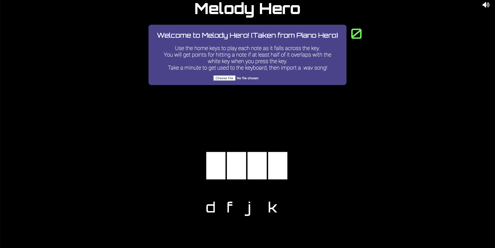
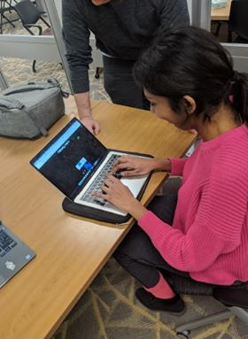
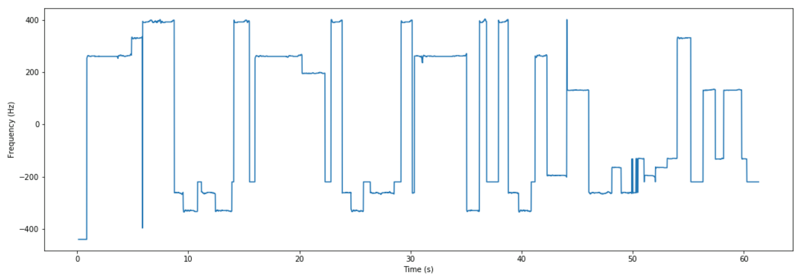
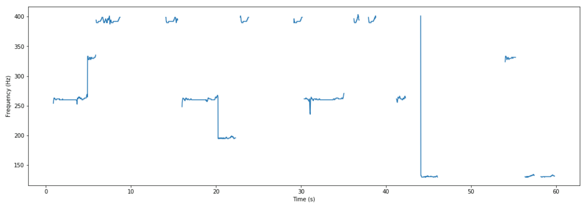
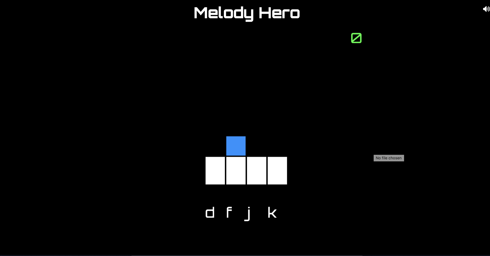
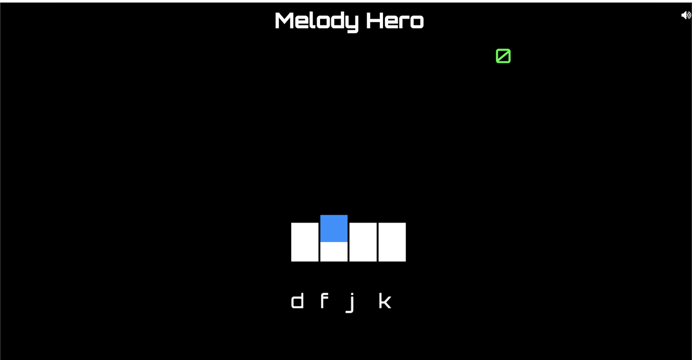
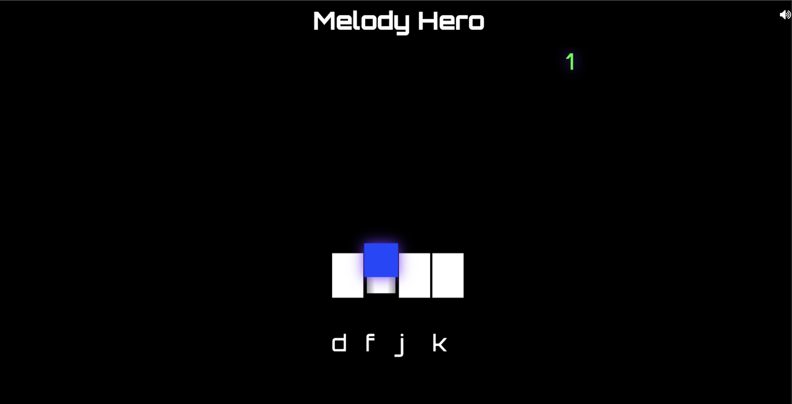

## Introducing Melody Hero

Do you like the idea of Guitar Hero, but never could get into to the music? Melody Hero let's you play your favortie song in a mobile desktop game! Play your favorite songs on the go with Melody Hero!

### Contact
Nida Pervez:Nidapervez2020@u.northwestern.edu
Alex van der Heijden: vdhalex@u.northwestern.edu
David Wolff: davidwolff2020@u.northwestern.edu 

Machine Perception of Audio and Music Northwestern University Professor Bryan Pardo

### Motivation
  Melody Hero was inspired by a game that all three of us enjoy playing: Guitar Hero. The ability to interact with a game while playing songs was appealing to all of us, but we all agreed that the music choice for Guitar Hero was not for everyone. Another downfall to Guitar Hero was that you could only play it on a console, meaning that it lacked mobility. To combat those two restrictive measures of Guitar Hero, we came up with the idea Melody Hero. Melody Hero allows users to play a game similar to Guitar Hero, but with any song of their choice and anywhere! 

### Overview
  Similar to Guitar Hero, Melody Hero requires the user to select a song to play. Afterwards the page will generate a game interface with pieces moving from the top of the screen to where the “Keys” are on the screen, which is heavily inspired by the open source project "PianoHero". This is also similar to Guitar Hero where the notes are coming closer to where the symbolic-images of the keys are. Once the note is on top of the key-image, the user must press the button that corresponds with that key-image. In our case those are the keyboard button D, F, J, and K. When the user presses the keyboard button at the correct time, their score will increase, ultimately giving them a percentage score, also similar to Guitar Hero.
  

  
### Related Works
  Guitar Hero 5 does have an song import process, but it is barely usable. Since it's launch in 2009, Guitar Hero 5 was known to have a poor song import mechanism, which would allow users to import a song and be able to play the song on the Wii. Although it tackles the same problem that we face, we dcided to have the user be able to play the game on the browser instead of the Wii. It is rare to find someone with a Wii or Wii U that is able to play Guitar Hero, and being able to play a song right after you load it up is convenient.
   Guitar Hero: Warriors of Rock is an example of players being able to upload songs that they have created so that others can play it. This is closely related to what we are doing, where a player is able to play a song that they have inputted. But unlike Warriors of Rock where the players manually create their song level, MelodyHero attempts to automatically translate a song into a playable song level.
  
### Validation
  Melody Hero was built using Python, JavaScript, and Melodia as a pitch tracker. Melody Hero first requires the user to input their song as a .wav file. The file then goes through Melodia’s pitch-tracking algorithm where we can get the frequencies of the notes. The frequencies then go through another algorithm to dictate what keyboard-button they will correspond to. We calculate the onsets and send both the onsets and frequencies to the front end so that they can be processed and shown on the screen. The player then has to press the respective letter on the keyboard when the block is over the piano-key-looking part of the interface. The player plays through the entirety of their song and accumulates points for every note pressed at the correct time. We will measure our accuracy by comparing it to the pitch tracker as well as using user-performance ratings.

### Results
  While working on our project, we quickly found that the project we had in mind would have to be scaled down for our specific time frame. For those reasons, we mainly focused on being able to play any of the songs in the Medley database. However, the algorithms still work on any song, but to get the best outcome, we recommend using monophonic .wav files. In terms of checking its performance, we mainly focused on user-testing to see if the game felt like an actual game. After testing multiple users, we took into account their feedback and implemented the respective changes. Overall, from our user feedback, we know that it feels like a game, and that there are enough prominent notes to piece together the song. In terms of Justin Salamon’s pitch tracking algorithm, we acknowledge that the pitch tracker is not completely accurate and has flaws in it of itself, so we also found flaws in our pitches. We got our onsets using librosa, but we also found that our onsets were also sometimes flawed. Pitch tracking is already very difficult to perfect and despite Melodia being one of the best pitch trackers in the market, it is still not perfect.
  

This is the pitch tracker including all negative frequencies

This is the pitch tracker omitting all negative frequencies

### Conclusion
  We have presented a way to be able to play a song in a guitar hero level format, where the user is able to directly play a song of their choice. Using Melodia and librosa as our method of extracting pitch and onsets of the melody, we were able to create a game that the user can enjoy!
   Regarding what can be done for the future on this project, being able to grab accurate and timely frequencies consistently is a big part of it. One of the things that we struggled most with was being able to create a <b>playable</b> game from a song, because often times if not regulated, the game will be impossible to play due to the sheer amount of notes running. Another area of work that can be done is having the entire song play. Librosa / Melodia only outputs the first snippet a song, which clearly limits what the user can actually play.

### Gallery

### References 
https://github.com/justinsalamon/melodia_python_tutorial/blob/master/melodia_python_tutorial.ipynb
https://github.com/ksalehi/PianoHero

